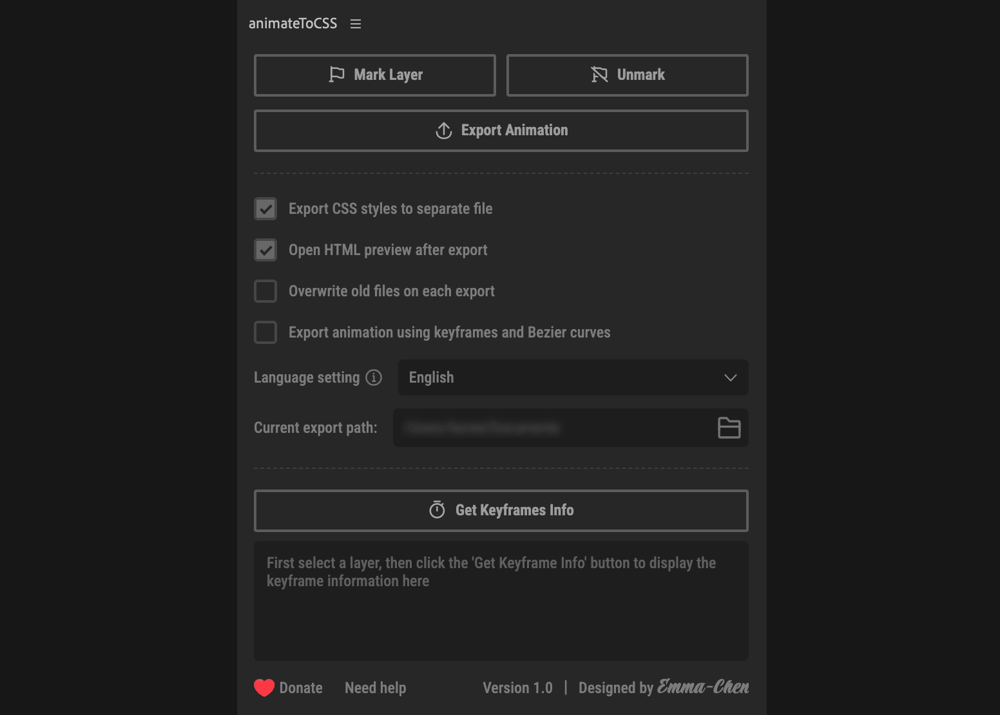
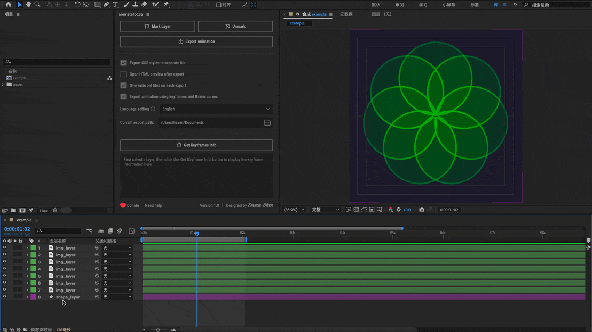
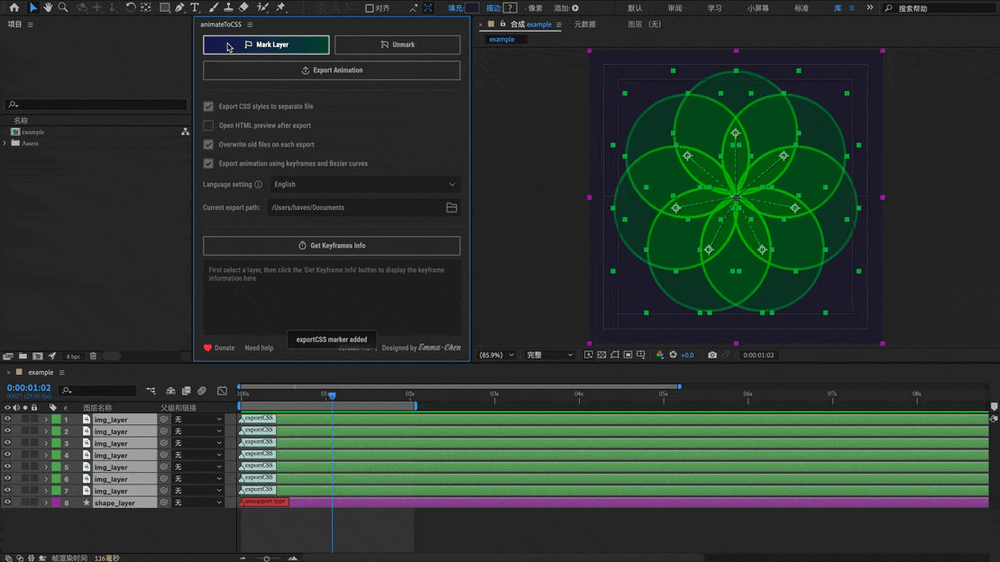
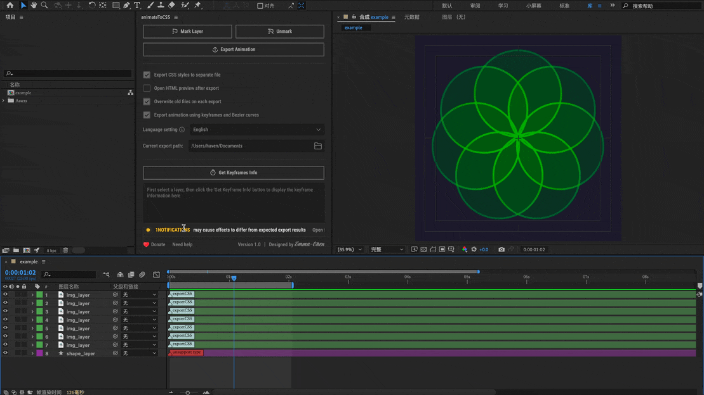
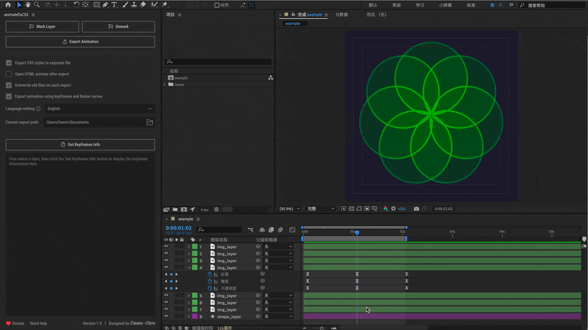

# AnimateToCSS

[简体中文](README.zh.md) | English

AnimateToCSS is an Adobe After Effects plugin developed by a designer that exports AE animations directly to HTML + CSS code with browser preview capability. It also provides one-click access to keyframe animation data from selected layers, making the designer-to-developer handoff process more efficient than ever. Why not give it a try?



## 📖 Table of Contents

- [Key Features](#-key-features)
- [System Requirements](#system-requirements)
- [Installation](#installation)
  - [Method 1: Using ZXP Installer](#method-1-using-zxp-installer-recommended)
  - [Method 2: Manual Installation](#method-2-manual-installation)
  - [Enable Plugin](#enable-plugin)
- [Features](#features)
  - [Two Export Modes](#two-export-modes)
  - [Multi-language Support](#multi-language-support)
- [Usage Guide](#usage-guide)
  - [1. Mark Layers](#1-mark-layers)
  - [2. Export Animation](#2-export-animation)
  - [3. Check Status](#3-check-status)
  - [4. Get Keyframe Information](#4-get-keyframe-information)
- [Common Issues](#common-issues)
- [Feedback & Donate](#feedback--donate)

## ✨ Key Features

- **Support for Keyframe Export**
- **Quick Access to Layer Keyframe Information**
- **Multiple Properties Support**: Position, Scale, Rotation, Opacity, Precomps and Parent-child Relationships
- **Developer Friendly**: Generate clean, maintainable CSS code with cubic-bezier timing functions
- **Multi-language Support**: Available in 20+ languages including Chinese, English, Japanese, and more

### Keywords
`after-effects-plugin` `css-animation` `motion-design` `animation-export` `web-animation` `designer-tools` `developer-tools` `ae-to-css` `keyframe-animation` `motion-graphics` `animation-workflow` `design-handoff` `front-end-development` `creative-tools` `adobe-extension`

## 📖 Table of Contents

- [Key Features](#-key-features)
- [System Requirements](#system-requirements)
- [Installation](#installation)
  - [Method 1: Using ZXP Installer](#method-1-using-zxp-installer-recommended)
  - [Method 2: Manual Installation](#method-2-manual-installation)
  - [Enable Plugin](#enable-plugin)
- [Features](#features)
  - [Two Export Modes](#two-export-modes)
  - [Multi-language Support](#multi-language-support)
- [Usage Guide](#usage-guide)
  - [1. Mark Layers](#1-mark-layers)
  - [2. Export Animation](#2-export-animation)
  - [3. Check Status](#3-check-status)
  - [4. Get Keyframe Information](#4-get-keyframe-information)
- [Common Issues](#common-issues)
- [Feedback & Support](#feedback--support)

## System Requirements

- Adobe After Effects 2022 (other versions haven't been tested yet)

## Installation

### Method 1: Using ZXP Installer (Recommended)

1. Download and install [ZXP Installer](https://aescripts.com/learn/zxp-installer/)

2. Install the plugin
   - [Download ZXP package](https://github.com/emmaChengreen/animateToCSS_release/releases/latest) `animateToCSS.zxp`
   - Open ZXP Installer
   - Drag the downloaded `animateToCSS.zxp` file into the ZXP Installer window
   - Or click the "File" menu button to select the `animateToCSS.zxp` file
   - Wait for installation to complete

### Method 2: Manual Installation

1. [Download ZIP package](https://github.com/emmaChengreen/animateToCSS_release/releases/latest) `animateToCSS.zip`
2. Extract the ZIP file into a folder
3. Copy the folder to After Effects extensions directory:

   - Windows
   ```
   C:\Program Files\Adobe\Common\CEP\extensions
   ```
   or user directory (recommended):
   ```
   C:\Users\[username]\AppData\Roaming\Adobe\CEP\extensions
   ```

   - macOS
   ```
   /Library/Application Support/Adobe/CEP/extensions
   ```

### Enable Plugin

1. Restart After Effects
2. Menu Bar -> Window -> Extensions -> AnimateToCSS

## Features

### Multi-language Support

| Language Type | Supported Languages                                            |
| ------------- | ------------------------------------------------------------- |
| East Asian    | Simplified Chinese, Traditional Chinese, Cantonese, Japanese, Korean |
| European      | English, French, German, Spanish, Italian, Portuguese, Russian |
| Nordic        | Swedish, Danish, Norwegian, Finnish                            |
| East European | Czech, Hungarian, Polish, Romanian, Ukrainian                  |
| Others        | Turkish, Vietnamese                                           |

### Two Export Modes

| Feature Type | Frame-by-Frame Export Mode | Keyframe and Bezier Export Mode | Unsupported Features |
| ------------ | ------------------------- | ------------------------------- | ------------------- |
| Best For | Complex animations<br>Complete reproduction | Simple to medium complexity animations<br>Easy manual adjustment | - |
| Layer Types | • Precomps<br>• Text<br>• Solid<br>• Null<br>• Image | • Precomps<br>• Text<br>• Solid<br>• Null<br>• Image | • PSD layers<br>• Shape layers (WIP)<br>• Camera layers<br>• Light layers |
| Properties | • Position (2D/3D)<br>• Scale<br>• Rotation<br>• Opacity<br>• Parent-child | • Position (2D/3D)<br>• Scale<br>• Rotation<br>• Opacity<br>• Parent-child | • Blur, glow effects<br>• Mask animations<br>• Shape animations<br>• Stroke animations |
| Animation Features | • Expression support<br>• Curve animation support<br>• Larger code size | • Bezier curve optimization<br>• Clean readable code<br>• Easy to adjust manually | |

## Usage Guide

### It's recommended to save your file before each export.
### Remember to select the composition you want to export before exporting.
### In frame-by-frame export mode, code size is directly related to frame rate - higher frame rates result in larger code size.

### 1. Mark Layers



Select the layers you want to export and click the mark button. Unsupported layers will be marked in red.

### 2. Export Animation



Click the "Export Animation" button to generate HTML+CSS code.

### 3. Check Status



If issues occur, you can check the export content and warning messages in the status panel. Click to locate the layer in AE.

### 4. Get Keyframe Information



Select a layer and click "Get Keyframe Info" to view and copy animation data
Including: animation start time, keyframe times, keyframe values, bezier values, and animation duration.

## Common Issues

| Issue | Cause | Solution |
| ----- | ----- | -------- |
| Text Layer Misalignment | • Text layer used as parent<br>• Too many nested parent-child relationships | • Avoid using text layers as parents<br>• Simplify parent-child hierarchy |
| Precomp Issues | • Deep precomp nesting<br>• Complex parent-child relationships | • Control precomp levels<br>• Simplify precomp structure |
| 3D Rotation in Bezier Mode Still Uses Frame-by-frame | 3D rotation implementation not perfect in Bezier mode (WIP) | • Wait for future updates |

## Feedback & Donate

If you encounter any issues or have suggestions for improvement, please feel free to:

1. [Submit an issue](https://github.com/emmaChengreen/animateToCSS_release/issues/new?template=bug_report_en.md) - Report bugs or request features
2. [View existing issues](https://github.com/emmaChengreen/animateToCSS_release/issues) - Check if your issue has already been reported

### How to Use the Bug Report Template

1. Click the "Submit an issue" link above
2. Choose the "Bug Report" template
3. The template will load automatically with the following sections:
   - Bug Description: Describe the issue in detail
   - Steps to Reproduce: List the specific steps to reproduce the issue
   - Expected Behavior: Explain what you expected to happen
   - Environment: Fill in your system and software versions
   - Additional Context: Optional screenshots or extra information

### Reporting Guidelines

- Please provide as much information as possible so I can locate the issue quickly
- Include screenshots or error messages if available
- Before submitting, check existing issues to avoid duplicates

### Support & Donate

If you find this project helpful, feel free to buy me a coffee!

<div align="center">
  <table>
    <tr>
      <td align="center">
              <a href="https://www.paypal.com/paypalme/emmaChengreen/10">
                
              </a>
            </td>
            <td align="center">
              <a href="https://www.paypal.com/paypalme/emmaChengreen/5">
                
              </a>
            </td>
      <td align="center">
        
      </td>
      <td align="center">
        
      </td>
    </tr>
  </table>
</div>
