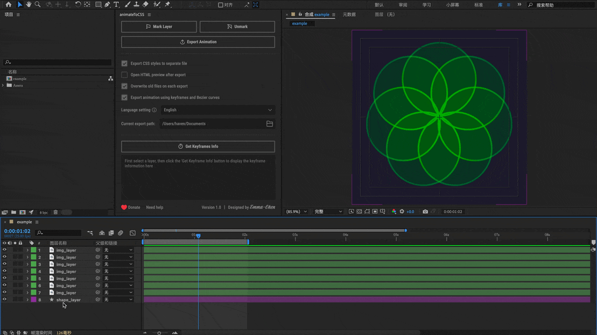
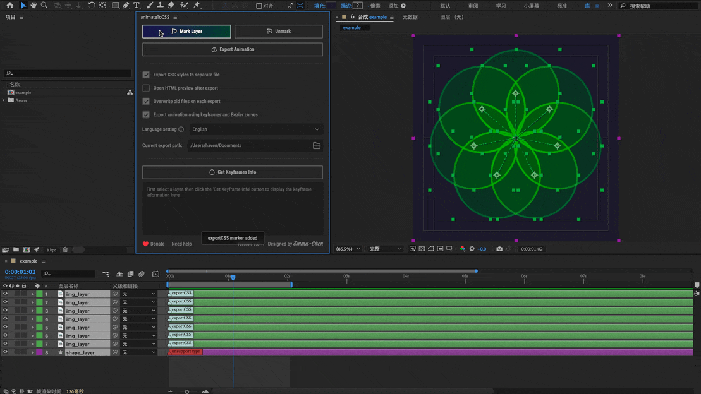

# AnimateToCSS

简体中文 | [English](README.md)

AnimateToCSS 是一个由设计师开发的 Adobe After Effects 插件，它可以将 AE 动画直接导出为 HTML + CSS 代码，在浏览器中预览。还能通过一键获取选中图层的关键帧动画信息，使设计师到开发者的交付过程更加高效。不来试试吗？


## 📖 目录

- [核心特点](#-核心特点)
- [软件要求](#软件要求)
- [安装方式](#安装方式)
  - [方式一：使用 ZXP Installer](#方式一使用-zxp-installer推荐)
  - [方式二：手动安装](#方式二手动安装)
  - [启用插件](#启用插件)
- [功能特点](#功能特点)
  - [两种导出模式](#两种导出模式)
  - [多语言支持](#多语言支持)
- [使用教程](#使用教程)
  - [1. 标记图层](#1-标记图层)
  - [2. 导出动画](#2-导出动画)
  - [3. 查看状态](#3-查看状态)
  - [4. 获取关键帧信息](#4-获取关键帧信息)
- [常见问题](#常见问题)
- [问题反馈与打赏](#问题反馈与打赏)

## ✨ 核心特点

- **支持通过关键帧导出**
- **快速获取图层关键帧信息**
- **支持多种属性**：位置、缩放、旋转、透明度，预合成和父子关系
- **开发者友好**：生成简洁、可维护的 CSS 代码，并支持贝塞尔曲线
- **多语言支持**：支持 20+ 种语言，包括中文、英文、日文等

### 关键词

`after-effects-插件` `css-动画` `动效设计` `动画导出` `web-动画` `设计工具` `开发工具` `ae-转-css` `关键帧动画` `动态图形` `动画工作流` `设计交付` `前端开发` `创意工具` `adobe-扩展`

## 软件要求

- Adobe After Effects 2022（其他版本我还没测试过）

## 安装方式

### 方式一：使用 ZXP Installer（推荐）

1. 下载并安装 [ZXP Installer](https://aescripts.com/learn/zxp-installer/)

2. 安装插件
   - [下载插件 zxp 包](https://github.com/emmaChengreen/animateToCSS_release/releases/latest) `animateToCSS.zxp`
   - 打开 ZXP Installer
   - 将下载的 `animateToCSS.zxp` 文件拖入 ZXP Installer 窗口
   - 或者点击 菜单栏的"文件" 按钮选择 `animateToCSS.zxp` 文件
   - 等待安装完成

### 方式二：手动安装

1. [下载插件 zip 包](https://github.com/emmaChengreen/animateToCSS_release/releases/latest) `animateToCSS.zip`
2. 将 zip 文件解压成一个文件夹的形式
3. 再将文件夹复制到 After Effects 扩展目录：

   - Windows

   ```
   C:\Program Files\Adobe\Common\CEP\extensions
   ```

   或者用户目录（推荐）：

   ```
   C:\Users\[用户名]\AppData\Roaming\Adobe\CEP\extensions
   ```

   -  macOS

   ```
   /Library/Application Support/Adobe/CEP/extensions
   ```

### 启用插件

1. 重启 After Effects
2. 菜单栏 -> 窗口 -> 扩展 -> AnimateToCSS

## 功能特点

### 多语言支持

| 语言类型 | 支持的语言                                                        |
| -------- | ----------------------------------------------------------------- |
| 东亚语言 | 简体中文、繁体中文、粤语、日本語、한국어                          |
| 欧洲语言 | English、Français、Deutsch、Español、Italiano、Português、Русский |
| 北欧语言 | Svenska、Dansk、Norsk、Suomi                                      |
| 东欧语言 | Čeština、Magyar、Polski、Română、Українська                       |
| 其他语言 | Türkçe、Tiếng Việt                                                |

### 两种导出模式

| 功能类型 | 逐帧导出模式                                                  | 关键帧和贝塞尔导出模式                                        | 不支持的功能                                                         |
| -------- | ------------------------------------------------------------- | ------------------------------------------------------------- | -------------------------------------------------------------------- |
| 适用场景 | 复杂动画效果<br>完整还原                                      | 简单到中等复杂度动画<br>易于手动调整                          | -                                                                    |
| 图层类型 | • 预合成<br>• 文本<br>• 纯色<br>• 空对象<br>• 图片            | • 预合成<br>• 文本<br>• 纯色<br>• 空对象<br>• 图片            | • PSD 图层<br>• 形状图层（努力解决中）<br>• 摄像机图层<br>• 灯光图层 |
| 相关属性 | • 位置（2D/3D）<br>• 缩放<br>• 旋转<br>• 透明度<br>• 父子关系 | • 位置（2D/3D）<br>• 缩放<br>• 旋转<br>• 透明度<br>• 父子关系 | • 模糊、发光等效果<br>• 蒙版动画<br>• 形状动画<br>• 描边动画         |
| 动画特性 | • 表达式支持<br>• 曲线动画支持<br>• 代码体积较大              | • 贝塞尔曲线优化<br>• 代码简洁易读<br>• 易于手动调整          | -                                                                    |

## 使用教程

### 每次导出前，建议你先保存文件。

### 导出前记得选择需要导出的合成。

### 逐帧导出模式下，代码量和帧速率相关，帧速率越高，代码量越大。

### 1. 标记图层



选择要导出的图层，点击标记按钮进行标记。不支持的图层标记是红色的。

### 2. 导出动画



点击"导出动画"按钮，生成 HTML+CSS 代码。

### 3. 查看状态


如果出现问题了可以在状态面板中查看导出内容和警告信息。点击可以定位到 AE 中对应的图层。

### 4. 获取关键帧信息


选择图层后点击"获取关键帧信息"，可以查看和复制动画数据,
包括：动画起始时间，关键帧时间，关键帧值，贝塞尔值，动画运行时间。

## 常见问题

| 问题                               | 原因                                           | 解决方案                                         |
| ---------------------------------- | ---------------------------------------------- | ------------------------------------------------ |
| 文本图层错位                       | • 文本图层作为父级使用<br>• 嵌套过多父子级关系 | • 避免使用文本图层作为父级<br>• 简化父子层级结构 |
| 导出的预合成有问题                 | • 预合成层级过深<br>• 复杂的父子关系           | • 控制预合成层级<br>• 简化预合成内的结构         |
| 贝塞尔导出 3D 旋转为何还是逐帧动画 | 贝塞尔模式下 3D 旋转实现不完美 （努力解决中）  | • 等待后续版本优化                               |

## 问题反馈与打赏

如果你遇到任何问题或有改进建议，欢迎：

1. [提交问题](https://github.com/emmaChengreen/animateToCSS_release/issues/new?template=bug_report_zh.md) - 报告 bug 或请求新功能
2. [查看已有问题](https://github.com/emmaChengreen/animateToCSS_release/issues) - 看看你的问题是否已被报告

### 如何使用 Bug 报告模板

1. 点击上方的“提交问题”链接
2. 选择"错误报告"模板
3. 模板会自动加载，包含以下部分：
   - 错误描述：请详细描述你遇到的问题
   - 重现步骤：列出具体的操作步骤
   - 预期行为：说明你期望的正确结果
   - 环境信息：填写你的系统和软件版本
   - 其他信息：可选填写截图或其他补充信息

### 报告注意事项

- 请尽可能填写完整的信息，这样我就能更快地定位问题
- 如果可能，请提供截图或错误信息
- 在提交之前，建议先查看已有问题，避免重复报告

### 支持与赞赏

如果你觉得这个项目对你有帮助，欢迎给予支持！

<div align="center">
  <table>
    <tr>
      <td align="center">
        
      </td>
      <td align="center">
        
      </td>
      <td align="center">
        <a href="https://www.paypal.com/paypalme/emmaChengreen/10">
          
        </a>
      </td>
      <td align="center">
        <a href="https://www.paypal.com/paypalme/emmaChengreen/5">
          
        </a>
      </td>
    </tr>
  </table>
</div>
